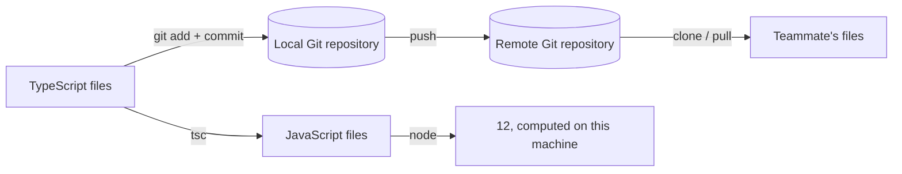
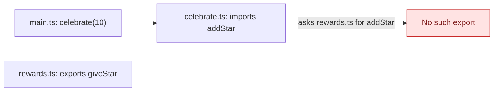
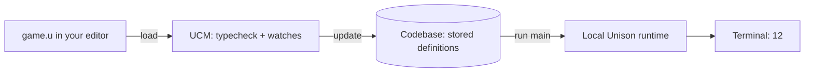
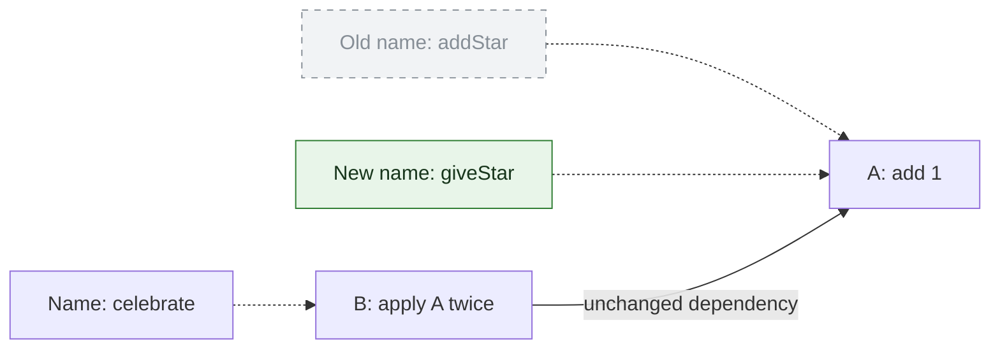

# From Git files to Unison functions: make a rename disappear

You have a working TypeScript program. You rename one exported function, miss an import, and the build fails.
Unison changes the relationship that made that failure possible: stored callers refer to definitions by identity, independently of their names.

Let's earn that claim. We will build the same tiny game twice, run it, and rename its reward function.
First with files and Git. Then with Unison.

## 1. Start with three files and a working game

Our game gives a player one extra star, twice. A score of `10` becomes `12`.
You need Node.js, npm, and Git for this part. These commands create a new local project and install the TypeScript compiler:

```sh
mkdir star-game-ts
cd star-game-ts
git init -b main
npm init -y
npm install --save-dev typescript@5.9.3
mkdir src
```

Create `.gitignore` containing `node_modules/` and `dist/`, each on its own line.
Now create these three files. Follow the import from the entry point down to the reward function:

```text
star-game-ts/
├── src/
│   ├── rewards.ts       # defines addStar
│   ├── celebrate.ts     # imports and calls addStar
│   └── main.ts          # imports and calls celebrate
├── package.json
└── package-lock.json
```

In `src/rewards.ts`, define the smallest useful reward:

```typescript
export function addStar(score: number): number {
  return score + 1;
}
```

In `src/celebrate.ts`, import that function by its exported name and module path:

```typescript
import { addStar } from "./rewards";

export function celebrate(score: number): number {
  return addStar(addStar(score));
}
```

In `src/main.ts`, print the result:

```typescript
import { celebrate } from "./celebrate";

console.log(celebrate(10));
```

Compile the files to JavaScript, then ask Node to run the entry point:

```sh
npx tsc --strict --noEmitOnError --target ES2022 --module commonjs --outDir dist src/*.ts
node dist/main.js
```

The program prints `12`. TypeScript checks and translates the source; Node executes the resulting JavaScript. Git does neither.

## 2. Git records and distributes the files

Save the working version in Git. A configured Git name and email are required for the commit:

```sh
git add .gitignore package.json package-lock.json src
git commit -m "Give a player two stars"
git log --oneline
```

You now have a commit recording the file tree. `git log` shows its identifier and message.
Git stores content-addressed objects already: blobs for file contents, trees for directory structure, and commits for history.
The compiler separately interprets the functions inside those files. [Git's object model](https://git-scm.com/book/en/v2/Git-Internals-Git-Objects)

To share this exercise, first create an empty remote repository you own. Replace `YOUR_HANDLE` below with your account:

```sh
git remote add origin https://github.com/YOUR_HANDLE/star-game.git
git push -u origin main
```

The remote now has the committed files and their history. A teammate can obtain them and reproduce the program:

```sh
git clone https://github.com/YOUR_HANDLE/star-game.git teammate-game
cd teammate-game
npm ci
npx tsc --strict --noEmitOnError --target ES2022 --module commonjs --outDir dist src/*.ts
node dist/main.js
```

Their machine prints `12` too. Each clone has its own local repository; commits and refs move between repositories.
That is **distributed version control**. Running the game on a server would require a separate build/run or deployment step.
A Git push only triggers computation if you have configured something, such as CI, to react to it. [Git push](https://git-scm.com/docs/git-push)

The two paths serve different purposes:



## 3. A partial rename breaks the build

Back in the original project, make a branch for the rename:

```sh
git switch -c rename-reward
```

This creates and selects `rename-reward`. Change **only** `src/rewards.ts`:

```typescript
export function giveStar(score: number): number {
  return score + 1;
}
```

The behavior looks identical. Run the compiler again:

```sh
npx tsc --strict --noEmitOnError --target ES2022 --module commonjs --outDir dist src/*.ts
```

The build fails with a diagnostic like:

```text
src/celebrate.ts: Module '"./rewards"' has no exported member 'addStar'.
```

The import still asks for a name that the module no longer exports.
`celebrate` cannot compile, so neither can this complete application. Previously built or deployed JavaScript does not spontaneously change.

A good IDE rename can update the import and calls together. You can also preserve the old export as an alias.
Here we deliberately changed only the declaration to expose what connects the program: **names in source text**.
TypeScript catches our mistake before a new build ships. [TypeScript modules](https://www.typescriptlang.org/docs/handbook/2/modules.html)

The dependency chain now contains an unresolved name:



Repair `src/celebrate.ts` by changing its import and both calls:

```typescript
import { giveStar } from "./rewards";

export function celebrate(score: number): number {
  return giveStar(giveStar(score));
}
```

Repeat the compile and `node dist/main.js` commands: the result is `12` again.
Inspect and save the repair, then merge it into `main`:

```sh
git diff
git add src/rewards.ts src/celebrate.ts
git commit -m "Rename the reward and update its caller"
git switch main
git merge rename-reward
```

Both files changed, even though the reward stayed the same.
Moving `rewards.ts` into another directory would likewise require repairing the relative import path.
Git records those edits and helps integrate them; it does not bind a language-level call to a function's identity.

## 4. Meet UCM before writing any Unison

**UCM means Unison Codebase Manager.** It is a program you install and run on your laptop, usually in a terminal.
It manages the database holding your Unison code, checks new definitions, and provides commands to run programs.
You do not need a cloud account to use it locally. [UCM tour](https://www.unison-lang.org/docs/tour/)

Keep these three things separate:

| Thing | Job | Where it is in this exercise |
|---|---|---|
| **UCM** | Accept commands; typecheck, store, find, edit, version, and run code | A local terminal process |
| **Codebase** | Persist definitions, names, projects, and history | A local database on disk |
| **Runtime** | Evaluate the program's instructions and perform supported effects | Runs locally when UCM executes our program |

UCM includes access to the runtime, but managing a codebase and executing a program are different jobs.
Unison also supports packaged programs run through `ucm run.compiled`; an interactive UCM process is not required in production.
A `.uc` package contains bytecode and dependencies and needs a compatible runtime. [Running programs](https://www.unison-lang.org/docs/usage-topics/running-programs/)

Unison still has **code**. It has functions, values, data types, records, and abilities for effects.
You compose functions over data rather than needing a class to own each operation.
The new idea here is the stored unit: individual definitions have identities, independent of a source file or public name.
[Values and terms](https://www.unison-lang.org/docs/fundamentals/values-and-functions/terms/)

## 5. Give the program a local home

Install UCM using the [official quickstart](https://www.unison-lang.org/docs/quickstart/), then open a fresh shell outside the TypeScript project.
These commands create a working directory and a separate codebase for the exercise:

```sh
mkdir star-game-unison
cd star-game-unison
ucm -C .ucm-codebase --no-file-watch
```

UCM opens an interactive prompt. `.ucm-codebase` is the database directory; the current directory is where we will write scratch files.
We disabled automatic file watching so you can see exactly when code is loaded.
A plain `ucm` normally uses the default codebase in `~/.unison`.

At the UCM prompt, enter the command after `>`; do not type the prompt itself:

```text
scratch/main> project.create star-game
```

UCM creates a project with a `main` branch, downloads the base library, and selects `star-game/main`.
This setup step needs network access. The game runs locally afterward.

The name `star-game/main` means **project / branch**, not a directory path.
Your database can hold many projects, and each project can have several branches.

## 6. Write the same game in one scratch file

Keep UCM open. In your editor, create `game.u` inside `star-game-unison` with this code:

```unison
addStar : Nat -> Nat
addStar score = score Nat.+ 1

celebrate : Nat -> Nat
celebrate score = addStar (addStar score)

> celebrate 10
```

`Nat` is an unsigned whole-number type; our tiny inputs avoid its numeric limits.
`Nat -> Nat` means “take a `Nat`, return a `Nat`.” Function application uses spaces: `addStar score`.
The line starting with `>` is a **watch expression**: evaluate this expression and show its result.

Save the file, then load it explicitly in UCM:

```text
star-game/main> load game.u
```

UCM checks the definitions and evaluates the watch. The relevant output is:

```text
> celebrate 10
      ⧩
      12
```

You have run Unison code. You have **not yet saved these definitions into the codebase**.
`game.u` is the editing input; `load` checks and evaluates that input; `update` persists the loaded definitions.

Now save them into the database:

```text
star-game/main> update
```

UCM reports completion. The stored program is now available independently of `game.u`.
After a successful update, deleting that scratch file does not delete the program. Deleting unsaved edits can still lose work.

## 7. Run an actual entry point

A watch is useful feedback while editing. For a program that prints to the terminal, append this entry point to `game.u`:

```unison
main : '{IO, Exception} ()
main = do printLine (Nat.toText (celebrate 10))
```

Read this signature in pieces. The leading `'` delays the computation until you run it.
`IO` allows effects such as printing; `Exception` allows failure; `()` is the empty result after printing.
`Nat.toText` turns `12` into printable text.

Load the revised file, persist it, then run the entry point:

```text
star-game/main> load game.u
star-game/main> update
star-game/main> run main
```

The terminal prints `12`. UCM may also display `()` as the entry point's return value.
This computation happened on your laptop. There was no remote worker involved.

Notice the full path from text to behavior:



UCM can also run a definition from the most recently loaded file. Persisting first makes the saved state explicit here.

## 8. Rename the stored function and leave its caller alone

We now repeat the TypeScript experiment: change the public name of the reward function.
This time, tell UCM to rename the stored term:

```text
star-game/main> move.term addStar giveStar
star-game/main> view celebrate
```

UCM completes the rename and displays the stored caller using its current names:

```unison
celebrate : Nat -> Nat
celebrate score = giveStar (giveStar score)
```

We did not edit `celebrate`. We did not load a repaired caller.
UCM is showing readable text for a definition whose dependency was already fixed to the right identity.

Run the program again:

```text
star-game/main> run main
```

It still prints `12`. The rename changed a name associated with the reward, while the stored program kept the same dependency.

Your old scratch file can still contain the spelling `addStar`.
A UCM rename does not rewrite arbitrary text files, URLs, or external clients.
Before another edit, clear the already-saved contents of `game.u`, then ask UCM to write the current definitions into it:

```text
star-game/main> edit main celebrate giveStar
```

UCM prepends those definitions to its most recently loaded file, using their current names.
You are getting editable source **from the codebase**. You are no longer treating the old file as the authoritative program.

## 9. See why the rename did not break the program

In a content-addressed store, an item's address is derived from its contents.
Change those contents and you get a different address. A name can point to that address without becoming part of it.

For our function, Unison hashes a normalized representation of the code's structure, with resolved dependency references.
The public name lives separately; argument names become positional references. Ordinary whitespace and source comments do not determine identity.
The following is a teaching sketch, not the actual serialization format. [The big idea](https://www.unison-lang.org/docs/the-big-idea/)

```text
addStar score = score Nat.+ 1

stored structure: apply builtin-Nat.+ to (argument 0, literal 1)
content address:  A
name table:       addStar → A

celebrate score = addStar (addStar score)

stored structure: apply A to (apply A to argument 0)
content address:  B
name table:       celebrate → B
```

Here **A** and **B** are readable placeholders for hashes, not real UCM references.
The caller stores a reference to **A**, rather than the text `addStar`.

Only the dotted name arrow moves during our rename:



The old dotted arrow is removed; the new one replaces it. The solid dependency arrow never moves.
When UCM displays **B**, it looks up today's readable name for **A**. That is why `view celebrate` shows `giveStar`.

If another programmer writes `awardPoint points = points Nat.+ 1` with the same resolved dependencies, it has the same identity.
Our [identity test](../examples/content-addressing.md) checks that directly using definition references.
This is structural identity, not a proof that every algorithm producing the same answers has the same hash.
Unique types also deliberately distinguish some declarations with identical visible shapes. [Type identity](https://www.unison-lang.org/docs/fundamentals/data-types/unique-and-structural-types/)

Both Git and Unison use hashes. **Unison makes definition identity part of how the language refers to code.**
That reaches inside the program, beneath the files that Git versions.

A stable identity lets another runtime request the exact definition it needs. Next, we will use that fact to explain remote computation.
[Continue with branches, sharing, remote computation, and map/reduce](02-your-codebase-is-not-a-folder.md).

---

Local examples checked with TypeScript 5.9.3, Node 22.23.1, and UCM 1.4.0.
The [walkthrough checks](../scripts/check_orientation.py) reproduce the TypeScript failure/repair and Unison load/run/rename behavior.
The Git collaboration check uses a local bare remote; this guide does not require publishing the sample to GitHub.
