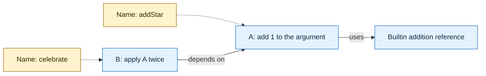
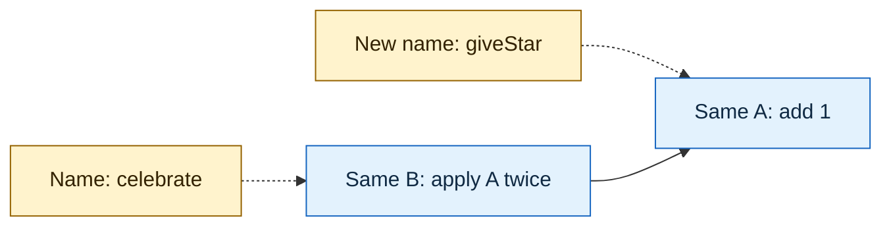
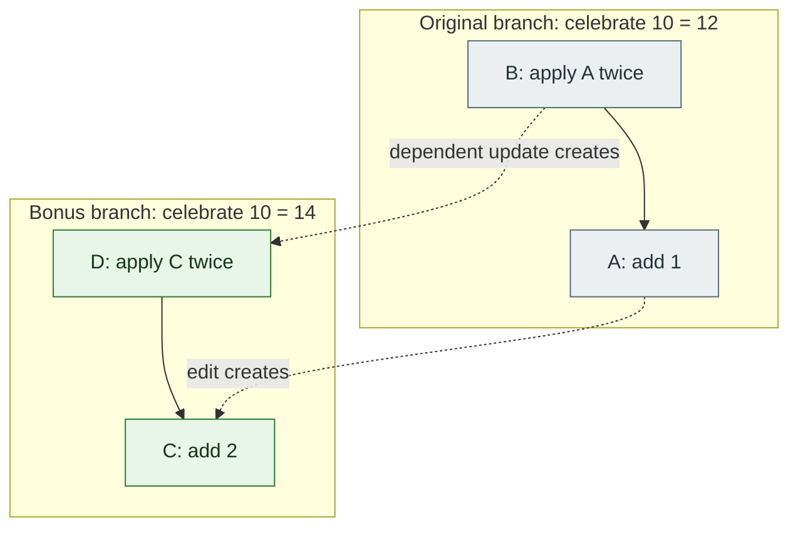

# Your function can survive a name change

Imagine renaming a function without rewriting a single caller.
You move it into another namespace. Its callers still work.
You discover that someone else wrote it under a different name. Unison can recognize the same definition.

The trick: **a function's name is a label. Its identity comes from its contents.**

This is the first of two guides for programmers arriving from files and Git.
Read this one for the idea, then [the second guide](02-your-codebase-is-not-a-folder.md) for everyday work.

## Give a player two stars

Here is a small Unison program. `Nat` is a nonnegative integer, and `Nat.+` adds two of them.
Function calls use spaces: `addStar score` calls `addStar` with `score`.

```unison
addStar : Nat -> Nat
addStar score = score Nat.+ 1

celebrate : Nat -> Nat
celebrate score = addStar (addStar score)
```

`celebrate 10` produces `12`. Nothing surprising yet.

When the Unison Codebase Manager (UCM) stores these definitions, the caller refers to a particular definition of `addStar`.
Below, **A** and **B** stand for content hashes. They are teaching labels, not real hashes you can paste into UCM.

The names point to definitions; the definitions point to their dependencies.



**Dotted arrows are names. Solid arrows are code dependencies.**
Those are different relationships, and Unison stores them separately.

## Rename the label; leave the program alone

Suppose `giveStar` is a better name.
Inside UCM, `move.term addStar giveStar` changes that name.

The graph of definitions stays exactly where it was.



`celebrate` still refers to **A**. There is no stored call-site spelling to repair.
When UCM displays the function, it chooses available names for those references.
Its displayed text can change while the underlying definition stays the same.

An IDE can also perform a good rename in a conventional language.
The difference is what needs changing: source references there, the naming layer here.
Unison's [rename command](https://www.unison-lang.org/docs/ucm-commands/) operates on that naming layer.

## The hash describes code structure, not a screenshot of text

An **abstract syntax tree**, or AST, represents a parsed expression's structure.
For our function, think: “add the first argument and the literal `1`.”

Unison hashes a representation of that structure with resolved dependency references.
Argument names become positional references. The function's public name lives separately.
Whitespace and ordinary source comments do not supply its identity.

Conceptually, our little function becomes:

```text
function(argument 0):
    call builtin-addition(argument 0, literal 1)

content hash of that representation → A
name table: addStar → A
```

That is a teaching sketch, not Unison's serialized format.
The [official explanation](https://www.unison-lang.org/docs/the-big-idea/) describes hashing syntax trees and resolving references.

Now write the same definition with different labels:

```unison
awardPoint : Nat -> Nat
awardPoint points = points Nat.+ 1
```

In [our executable example](../examples/content-addressing.md), `addStar` and `awardPoint` have equal definition references.
We test their identities, not merely whether both return `11` for one input.

**Two names. One stored definition.**

That does not mean Unison proves all equivalent algorithms identical.
Two differently structured programs can compute the same answer and have different hashes.
Also, deliberately distinct *unique types* carry identity beyond their visible shape.
See [type identity](https://www.unison-lang.org/docs/fundamentals/data-types/unique-and-structural-types/) before applying the function example to every declaration.

## Change the reward; create a new definition

Tomorrow is double-star day. Change the reward from `1` to `2`.

That produces a new definition, **C**.
Updating `celebrate` to call **C** produces a new caller, **D**, because a dependency reference changed.

The old and new programs can coexist:



The contents at **A** do not turn into **C**.
UCM applies an update to the branch's names and affected definitions.
The original branch can keep its earlier program.

For a compatible change like this, UCM can propagate the update.
If the change breaks dependent types, it guides you through repairing them on a temporary branch.
The [update workflow](https://www.unison-lang.org/docs/usage-topics/workflow-how-tos/update-code/) explains that process.

One detail matters in the runnable example: we remove the extra `awardPoint` alias before changing `giveStar`.
Keeping that alias can preserve callers' references to the old definition.
That is useful when you want two versions; here, we want a replacement.

## Git uses hashes too; look at what they identify

Git already has a content-addressed object database.
It stores file contents as blobs, directory structure as trees, and history as commits.
A Git blob does not interpret the functions inside a source file.
[Git's own documentation](https://git-scm.com/book/en/v2/Git-Internals-Git-Objects) explains these objects.

| Question | Conventional source code in Git | Unison |
|---|---|---|
| What identifies a stored unit? | Git object identity for blobs, trees, and commits | Definition identity for terms and types; additional identities for codebase history |
| What does a function call refer to? | A source-level name resolved by language tooling | A resolved definition reference |
| What does a function rename change? | Source text, including affected references | Names associated with definitions |
| Where do I edit? | Source files | Scratch files presented to UCM |
| What preserves versions? | Git history | UCM's codebase history and branches |

Moving an unchanged file in Git can preserve its blob hash.
The distinction here is that **Unison understands definition identity inside the language**.

## A stable address makes more things possible

A pure test tied to unchanged definitions can reuse its recorded result.
A live HTTP check cannot make the same promise: the world may have changed.
[Unison testing](https://www.unison-lang.org/docs/usage-topics/testing/) distinguishes these cases.

Two libraries can depend on different versions of a definition without competing for a single global name.
Different types still require compatible interfaces or an explicit conversion.
Rúnar Bjarnason explains that distinction in [this interview](https://www.devtools.fm/episode/45).

Distributed runtimes can use definition identity to identify and transfer missing code dependencies.
Unison Cloud builds [typed services](https://www.unison.cloud/learn/native-services/) on this foundation.
Networking, authorization, and operational failures still need handling.

The surprising part is how much follows from a small change in identity.
**You can reorganize what people call a program without changing what the program calls.**

Next: [where the code lives, how you edit it, and how a team shares it](02-your-codebase-is-not-a-folder.md).
