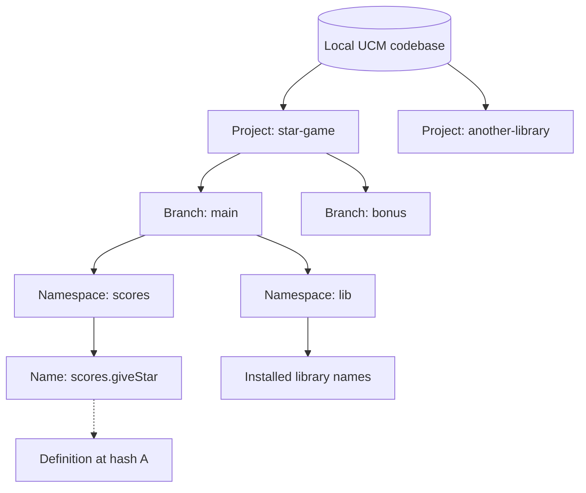
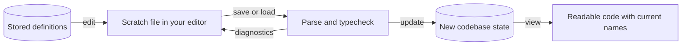
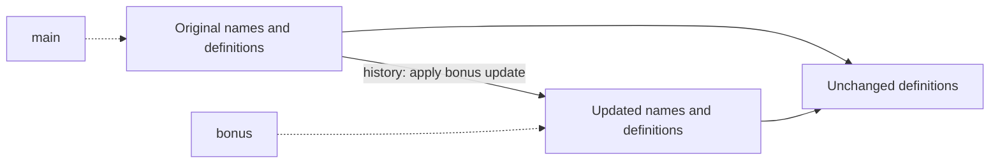
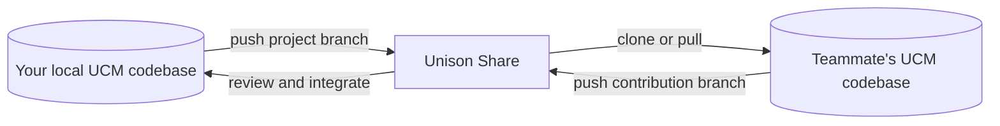

# Your codebase is a database you can program

Unison gives your code a home in a local database, managed by the **Unison Codebase Manager**, or **UCM**.
You still use a text editor. You still have projects, branches, history, and code review.
The change is where the authoritative program lives.

Read [the first guide](01-code-that-knows-its-own-name.md) for why definitions have content addresses.
Here, we will follow a program from your editor into the codebase, then into a teammate's hands.

## Four things replace the idea of one source folder

| Thing | What it means | Example |
|---|---|---|
| **Codebase** | Local database of definitions, names, projects, and history | A UCM database on your laptop |
| **Project** | An application or library you develop and share | `star-game` |
| **Branch** | A project's evolving set of names and definitions, with history | `main`, `bonus` |
| **Namespace** | A grouping of names within that branch | `scores`, `players`, `lib` |

The hierarchy looks familiar. The leaves resolve to definitions, rather than source files.
Here is one possible organization, not a required layout:



`scores.giveStar` is a qualified name. You do not need a `scores/giveStar.u` file to hold it.
The same definition may have several names, and different branches may share it.

By convention, dependencies live under `lib`; a project's `README` is itself a documentation definition.
[The organization guide](https://www.unison-lang.org/docs/tooling/projects-codebase-organization/) explains these conventions.

## Your editor becomes a workbench

A scratch file is where you prepare new definitions or edit existing ones.
Saving it lets UCM load and typecheck the code, usually through its file watcher.
`update` applies the loaded definitions to the codebase.

Follow the arrows carefully: a successful typecheck and a saved codebase change are separate events.



You can put several unrelated definitions in one scratch file.
You can bring just one function out for editing.
That file's directory layout does not dictate your project's namespace structure.

After a successful `update`, deleting the scratch file does not delete the stored definitions.
Before `update`, deleting your only copy of an edit can lose that work.
Keep useful working files, and back up the codebase as well.

UCM stores the program in a structured form and can display editable source again.
That display need not reproduce your original whitespace, ordinary comments, or file arrangement byte for byte.
Use Unison documentation definitions for durable API explanations.
[The tour](https://www.unison-lang.org/docs/tour/) and [documentation guide](https://www.unison-lang.org/docs/usage-topics/documentation/) explain these editing and documentation surfaces.

## You can watch the name change yourself

The easiest reproducible version needs an installed UCM and this repository.
Run this **shell command** from the repository root:

```sh
ucm transcript examples/content-addressing.md
```

It creates a disposable codebase, executes the example, and writes `examples/content-addressing.output.md`.
It leaves your normal codebase alone. The example is tested on UCM 1.4.0.

The transcript performs these **UCM commands** after loading the game functions from the first guide:

```text
scratch/main> update
scratch/main> move.term addStar giveStar
scratch/main> view celebrate
```

The rename changes the available name. `celebrate` still awards two stars.
The transcript also proves that differently named copies of the same function have equal definition references.
It removes the extra demonstration alias so the later update replaces the original definition within the branch.

Next it creates `bonus`, changes the reward to two stars per call, and updates the expected test result.
The bonus branch awards four stars. Switching back to `main` restores the original two-star behavior.
Both branches pass their own tests.

This is your first useful surprise: **two versions of the game, sharing unchanged code, inside one codebase**.

## Branches keep the familiar collaboration model

UCM owns the version-control workflow for stored Unison code.
You create a branch, make changes, inspect them, and merge when ready.
Branches can share existing definitions because those definitions are immutable.

In this diagram, both branch views initially point to the same code.
Only the bonus view advances when you apply the change there.



A definition hash identifies a definition. A history/state reference concerns the codebase's evolution.
Do not use those identities interchangeably.

`history` inspects change history; `reflog` helps inspect recorded movements through codebase state.
Recovery commands operate on that state, so inspect their scope before resetting anything.
See [codebase recovery](https://www.unison-lang.org/docs/usage-topics/resetting-codebase-state/).

The following command families help you navigate. These are UCM operations, not shell or Git commands.
Use `help <command>` for the syntax supported by your installed version.

| You want to… | Start with… |
|---|---|
| See projects and branches | `projects`, `branches` |
| Inspect names and definitions | `ls`, `find`, `view` |
| Find callers or dependencies | `dependents`, `dependencies` |
| Prepare and apply an edit | `edit`, `load`, `diff.update`, `update` |
| Work independently and integrate | `branch`, `switch`, `merge` |
| Inspect or recover history | `history`, `reflog`, relevant recovery help |
| Install a dependency | `lib.install` |

UCM records changes as you perform codebase operations; there is no required Git staging step for each definition.
Its [project workflows](https://www.unison-lang.org/docs/tooling/project-workflows/) describe branching, releases, and collaboration.

## Share is where teammates find your Unison project

[Unison Share](https://share.unison-lang.org/) hosts Unison projects and their definitions.
It provides browsable documentation and collaboration around projects, branches, releases, and contributions.

The familiar verbs remain useful:



Use `clone` when bringing a project locally to work on it.
Use `lib.install` when consuming a project as a dependency.
Publishing a branch and installing a library are different operations.

You still review behavioral changes. Two people changing the same definition can require conflict resolution.
Content addressing removes name/location coupling; it does not decide which competing implementation your team wanted.
See [Share hosting](https://www.unison-lang.org/docs/tooling/unison-share/) and [project workflows](https://www.unison-lang.org/docs/tooling/project-workflows/).

## Git still has a place around your Unison program

A project can contain web assets, shell scripts, deployment configuration, Markdown guides, and code in other languages.
Git remains useful for those files. Some projects also maintain exported `.u` files and explicit loading scripts.
Follow that project's convention, and establish which representation is authoritative.

This repository is a good example: GitHub hosts its guides, agent skills, and executable transcripts.
Those files teach and exercise UCM. They are not a copy of your working UCM database.

The practical habit is small: before editing, know the **codebase, project, and branch** you are working in.
After editing, verify both the behavior and the stored change.

Try the [rename-and-branch example](../examples/content-addressing.md), then use [the Unison skill](../skills/unison/SKILL.md) on your own project.
