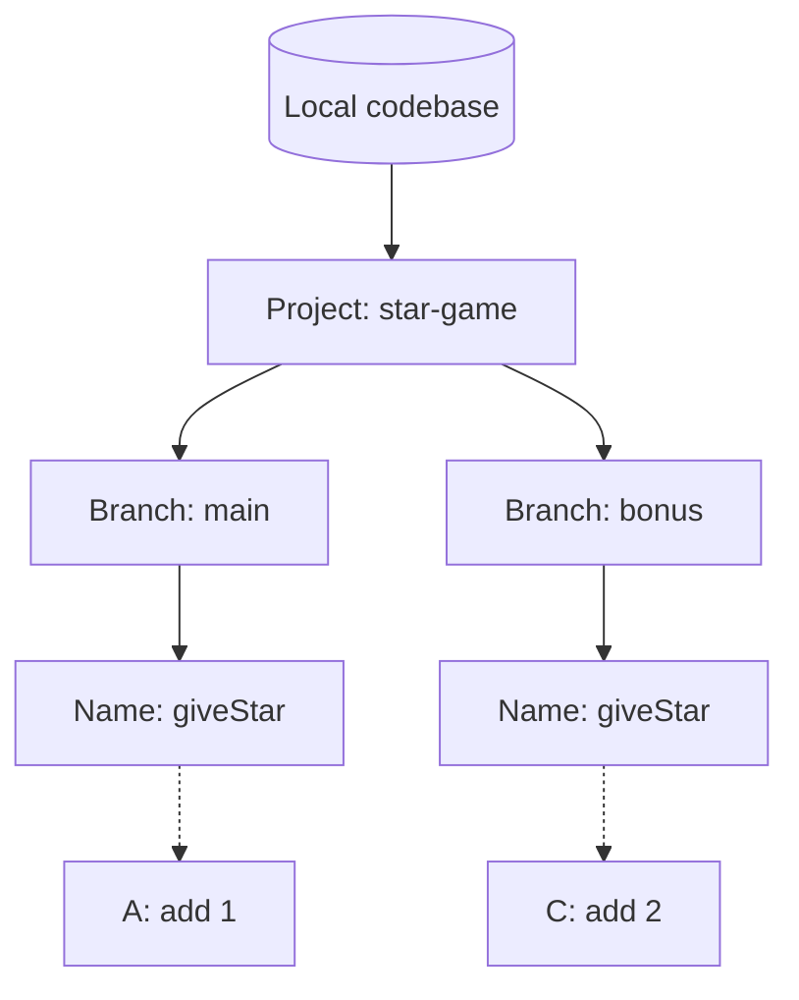
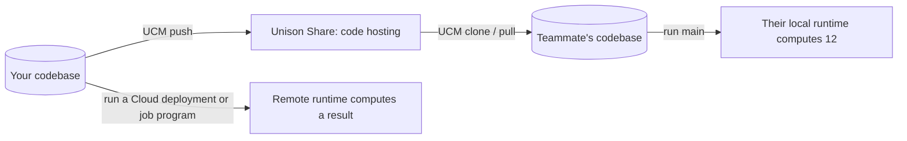
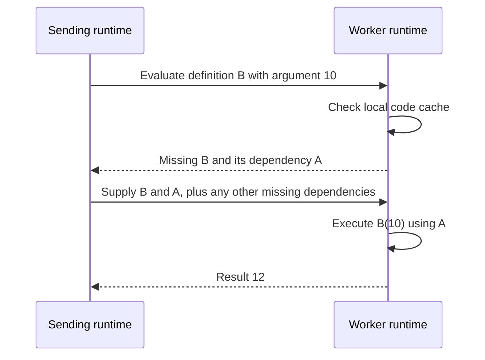
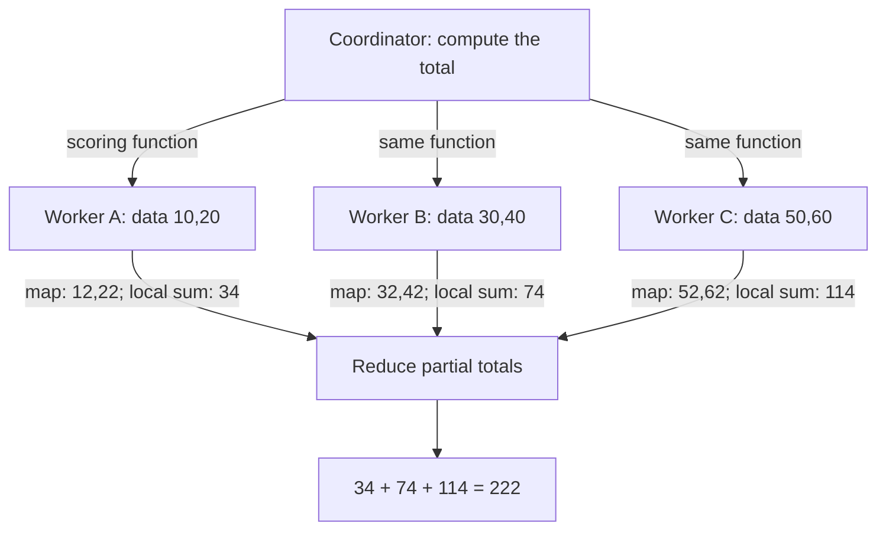

# From a saved function to a distributed program

Our game survived a rename because its callers refer to definitions by identity.
Now we can use that identity to organize versions, share code, and tell another runtime exactly what to execute.

This continues [the TypeScript-to-Unison walkthrough](01-code-that-knows-its-own-name.md).
Keep its `star-game/main` project open: `giveStar` adds one, and `main` prints `12`.
We will change the game on a branch, share it, then use the same scoring rule in a map/reduce calculation.

## 1. Your codebase has organization and history

A database of definitions does not mean a flat pile of anonymous functions.
UCM keeps a naming and project structure that people can navigate:

| Familiar idea | Unison counterpart | In our game |
|---|---|---|
| A place holding repositories | A local codebase can contain many projects | `.ucm-codebase` |
| An application or library repository | A project | `star-game` |
| A branch of development | A project branch, with names and history | `main`, soon `bonus` |
| Grouping code into modules/directories | Namespaces group names | `scores.giveStar` could group scoring names |
| Library dependencies | Installed definitions and names under `lib` | The base library |

These are useful comparisons, not identical storage models.
A namespace is a grouping of names; `scores.giveStar` does not require a `scores/giveStar.u` file.
A definition can have several names, and branches can share it. [Codebase organization](https://www.unison-lang.org/docs/tooling/projects-codebase-organization/)

Follow a branch's name to the actual definition:



The same readable name can refer to different definitions on different branches.
UCM's history records changes to this managed state. A definition hash and a branch/history reference identify different things.

## 2. Double-star day gets its own branch

Create and select a new branch in UCM:

```text
star-game/main> branch bonus
```

The prompt changes to `star-game/bonus`. The two branches initially share the same stored definitions.
Now replace the contents of the already-saved `game.u` with only this revised function:

```unison
giveStar : Nat -> Nat
giveStar score = score Nat.+ 2
```

Load and apply the behavior change on `bonus`, then run the existing entry point:

```text
star-game/bonus> load game.u
star-game/bonus> update
star-game/bonus> run main
```

The program prints `14`. We changed one definition; UCM propagated this compatible update to its stored dependents.
`celebrate` now applies the new reward twice, and `main` uses the new `celebrate`.

Unlike the rename, this is a new program. Its dependency references changed, so the affected definitions have new hashes.
The earlier definitions remain available through the original branch.

Switch back and run it:

```text
star-game/bonus> switch /main
star-game/main> run main
star-game/main> history
```

`main` prints `12`, and `history` shows recorded changes. No Git checkout of source files was needed to recover that program.
To accept double-star day on `main`, `merge /bonus` integrates the branch; leave it unmerged while following this guide.
Competing edits can still need conflict resolution. [Project workflows](https://www.unison-lang.org/docs/tooling/project-workflows/)

A compatible update is the easy case. If dependent types break, UCM provides a temporary branch for repairs.
Aliases also matter: preserving another name for the old definition can keep callers attached to it.
Our separate [identity example](../examples/content-addressing.md) removes its teaching alias before replacement. [Updating definitions](https://www.unison-lang.org/docs/usage-topics/workflow-how-tos/update-code/)

For navigation, start with `projects`, `branches`, `ls`, and `find`; `view` displays a definition.
Use `dependents` and `dependencies` to inspect relationships, and `diff.update` to preview a loaded change.

Use `reflog` when investigating earlier codebase states; consult the [recovery guide](https://www.unison-lang.org/docs/usage-topics/resetting-codebase-state/) before a reset.
Saving a scratch file, applying `update`, and backing up a codebase are separate operations.

## 3. Share the program with another developer

Unison Share hosts projects for collaboration and library discovery.
The role resembles a source host, but the program being shared is a codebase of definitions and names.
This is still **sharing code**, just as our Git push was sharing code. It does not start a scoring server.

If you want to publish this exercise, create a Unison Share account and choose the intended project visibility there.
The following UCM commands sign in and push the current branch. Replace `YOUR_HANDLE` with your account:

```text
star-game/main> auth.login
star-game/main> push @YOUR_HANDLE/star-game/main
```

The first command opens authentication; the second publishes the branch to that Share project.
A teammate can clone it into their own UCM codebase and run the saved entry point:

```text
scratch/main> clone @YOUR_HANDLE/star-game/main star-game/main
star-game/main> run main
```

Their runtime computes `12` on their machine. They receive the definitions needed by the program, including its library dependencies.
Use `clone` to work on a project and `lib.install` to consume a library. [Sharing projects](https://www.unison-lang.org/docs/tooling/unison-share/)

Here is the division of responsibility:



Git remains useful for images, web assets, configuration, other languages, and the Markdown you are reading.
Some projects keep exported `.u` files and loading scripts in Git; follow their convention about which representation is authoritative.
UCM's pretty-printed source need not retain ordinary comments, whitespace, or file layout exactly.
Durable Unison API docs are definitions too, including a project's `README`. [Documentation](https://www.unison-lang.org/docs/usage-topics/documentation/)

## 4. Remote computation needs a runtime at the other end

“Push a function to a remote UCM” blends two operations that we should name separately:

| Operation | Destination | What happens |
|---|---|---|
| Publish code | A Share project | Other developers can inspect and obtain it |
| Submit a job | A configured compute environment | A remote runtime evaluates a computation and returns a result |
| Deploy a service | A configured compute environment | A hosted function becomes available for subsequent calls |

Opening UCM on a second laptop does not automatically turn it into a worker.
A distributed setup needs compatible runtimes, connectivity, and an implementation of the remote-computation protocol.
Unison Cloud supplies such an environment; other deployment arrangements require their own setup. [Distributed runtime requirements](https://www.unison-lang.org/docs/usage-topics/general-faqs/)

For ordinary service deployment, developers often build an artifact containing code and its dependencies, install it, then call an endpoint.
Unison's runtime can identify a computation's dependencies through its definition references and synchronize missing code.
The destination can request the exact definition it lacks. Its file or module name does not need to match the sender's.
[How code identity enables distribution](https://www.unison-lang.org/docs/the-big-idea/)

Think of sending the computation `celebrate 10`. At a conceptual level, the receiver needs the definition reference and the input:



This sketches the dependency-sync idea, not a literal network packet format or a promise of one round trip.
Builtin dependencies require compatible runtime support.
A portable function value may also include the values of variables it closes over.
A definition hash alone is not the entire computation.

On the next call, a worker that already has those definitions can reuse them.
A pure rename does not give it new code to fetch. A behavior change does.
That connects the tiny rename experiment to deployment: **the machine asks which definition, not which spelling of a function name**.

## 5. Map/reduce starts with six players

Keep the original reward: `giveStar` adds one, and `celebrate` adds two.
Suppose we want the sum of six players' scores after celebrating each player:

```text
Input:       10, 20, 30, 40, 50, 60
Map:         apply celebrate to each score
After map:   12, 22, 32, 42, 52, 62
Reduce:      add the results
Answer:      222
```

**Map** transforms each item independently. **Reduce** combines the transformed values into one result.
For this example, addition is the combining operation and `0` is the result for an empty group.

Here is the local calculation in Unison, assuming the original `celebrate` is in scope:

```unison
batchTotal : [Nat] -> Nat
batchTotal scores = List.foldLeft (Nat.+) 0 (List.map celebrate scores)

> batchTotal [10, 20, 30, 40, 50, 60]
```

Loading this code evaluates the watch to `222`.
`List.map` transforms the list. `List.foldLeft` starts at `0` and adds each transformed score to the running total.

For six numbers, one machine is enough. Now imagine those inputs stand for large partitions of player data already on different workers.
Bring the scoring computation to each partition, combine there, and return only the partial totals:



The large data stays near its workers; the coordinator receives small answers.
Unison's [distributed-data article](https://www.unison-lang.org/articles/distributed-datasets/core-idea/) shows how remote values can preserve that placement.
Its [parallel reduction example](https://www.unison-lang.org/articles/distributed-datasets/reductions/) shows how forking and awaiting tasks control concurrency.

Map/reduce is not unique to Unison. The opportunity is to express placement and parallelism using ordinary typed library code.
The library and runtime do the network transport; the application supplies functions and decisions about where work belongs.
An ordinary `List.map` does not automatically distribute itself.

## 6. Make the remote calculation concrete

The `Remote` ability describes remote operations such as starting and awaiting tasks.
An **ability** lists operations a computation may request; a **handler** gives those requests an implementation.
A local handler can run an example on your laptop. A Cloud handler can use remote infrastructure. [Cloud concepts](https://www.unison.cloud/docs/core-concepts/)

The companion [Cloud example](../examples/checks/cloud-map-reduce.md) contains the complete game and the code below.
It uses the Cloud starter project's installed library names. Start a separate project in UCM by cloning the starter project:

```text
scratch/main> clone @unison/cloud-start cloud-star-game/main
```

This downloads the starter project and selects `cloud-star-game/main`. It does not deploy anything.
The inspected starter project used Cloud **27.2.0**; its main branch can change, so check `ls lib` when reproducing it.
The example records this baseline instead of assuming every tutorial's commands match your UCM release.

In that project, load the complete companion file's Unison block as `cloud-game.u`.
Its parallel calculation starts three tasks before waiting for their results:

```unison
parallelTotal : '{Remote} Nat
parallelTotal = do
  pool = Remote.region!
  first = Remote.fork pool do batchTotal [10, 20]
  second = Remote.fork pool do batchTotal [30, 40]
  third = Remote.fork pool do batchTotal [50, 60]
  (Remote.await first) Nat.+ (Remote.await second) Nat.+ (Remote.await third)
```

`Remote.region!` selects the current region's location abstraction; `Remote.fork` schedules a computation there and returns a task handle.
`Remote.await` obtains its result. Starting all three tasks before awaiting makes their work eligible to overlap.
The handler controls physical placement: **three tasks do not guarantee three separate machines**.

Our little example sends small lists as inputs. The diagram's “data already on workers” case additionally needs distributed data placement.
The [distributed-datasets series](https://www.unison-lang.org/articles/distributed-datasets/) builds that next layer; it is not automatic in this list example.

Two entry points can use the same calculation:

```unison
localScore : '{IO, Exception} Nat
localScore = Cloud.main.local do
  Cloud.submit !Environment.default parallelTotal

cloudScore : '{IO, Exception} Nat
cloudScore = Cloud.main do
  Cloud.submit !Environment.default parallelTotal
```

`Cloud.submit` submits a delayed job in an environment. `!Environment.default` obtains the default environment.
`Cloud.main.local` supplies the local implementation; `Cloud.main` supplies the Cloud implementation.
For a persistent callable service, use `Cloud.deploy` and a typed service reference instead. [Jobs and services](https://www.unison.cloud/learn/native-services/)

First save, load, and run locally:

```text
cloud-star-game/main> load cloud-game.u
cloud-star-game/main> update
cloud-star-game/main> run localScore
```

The expected result is `222`. This exercises the local Cloud handler; it does not prove network behavior or physical worker placement.
[Local Cloud development](https://www.unison.cloud/docs/local-development/) explains this distinction.

To actually run on Cloud, first set up a Cloud account and the intended environment.
The following commands authenticate and submit the job to remote compute; that submission uses your Cloud resources:

```text
cloud-star-game/main> auth.login
cloud-star-game/main> run cloudScore
```

A successful run returns `222` from the Cloud calculation. The local `run` starts the submission program; the remote runtime does the scoring work.
The remote path is provided for readers to execute, **not a claim that we deployed it while writing this guide**.
See [validation evidence](../research/validation.md) for precisely what ran.

## 7. The potential extends beyond a rename

**Refactoring can preserve executable identity.** An agent can organize or rename stored definitions while their dependents keep referring to the same code.
External protocols and stale source text still need deliberate updates.

**Reusable computation can cross process boundaries.** A function, its input, and its dependency identities provide a basis for remote work.
For an agent system, imagine testing a scoring function locally, then using that exact definition across a batch of evaluations.
This is a design opportunity, not a measured speedup or a guarantee that every function can move to every environment.

**Results can be reused when the computation permits it.** Pure tests tied to unchanged definitions can reuse recorded results.
Distributed memoization libraries can also cache work using code and input identity.
Fresh network responses, current time, or a changed database need different treatment. [Tests](https://www.unison-lang.org/docs/usage-topics/testing/), [distributed memoization](https://www.unison-lang.org/articles/distributed-datasets/incremental-evaluation/)

**Library versions can coexist without fighting over one global name.** Their code references remain specific.
You still need compatible types at an interface, and hashes do not perform data migrations for you.
The [maintainer interview](https://www.devtools.fm/episode/45) explores this distinction.

The engineering work shifts toward useful decisions: data placement, task size, failure handling, and access to effects.
Too many tiny tasks can cost more than they save. A worker can fail. Code identity does not grant authority to read private data.
Unison reduces some coordination around packaging and references; it does not abolish distributed-system design.

## 8. There are people and libraries to build with

You can continue from the exact questions this experiment creates:

| You want to… | Start here |
|---|---|
| Ask why a type or ability error occurs | [Discord through the official community hub](https://www.unison-lang.org/community/) |
| Read real code and discover dependencies | [Unison Share](https://share.unison-lang.org/) |
| Understand remote data and placement | [Distributed-datasets series](https://www.unison-lang.org/articles/distributed-datasets/) |
| See a distributed program drawn as tasks | [Remote computation visualization article](https://www.unison-lang.org/blog/visualizing-remote/), a historical 2023 example |
| Find current events and ways to contribute | [Official community page](https://www.unison-lang.org/community/) |
| Improve the toolchain | [Unison's GitHub repository](https://github.com/unisonweb/unison) and its issue tracker |

Discord is the community's primary discussion hub. Share is where you can browse definitions, docs, and library work.
The community page also links current events and contribution opportunities; use it for schedules instead of old video announcements.
The visualization article is a written companion with diagrams, not a transcript we independently checked.

A useful first contribution could be a small tested library, an improved example, or a reproducible toolchain issue.
Bring the UCM version, relevant type signatures, and a small transcript when asking for help.

Try changing the game rule one more time. Decide which change should keep the same identity, which needs a new definition, and where it should run.
